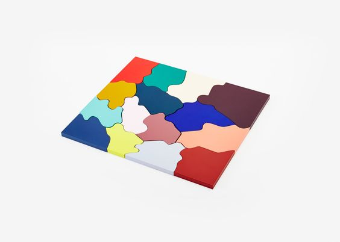

># Jiheui Yu's Crushing Bugs Project

>>This is about *Crushing Bugs project*. Here are all about this project.
First bug which we have to fix is that there should only be one piece in one drop zone at a time.
Second bug is to remove pieces on the drop zones when players click buttons for each theme.

## Getting Started
This is a basic HTML / CSS / JavaScript build.

## Prerequisites

An editor, git and programs.

## Authors
1. Jihee - dev

## License
This project is licensed under the MIT license.
